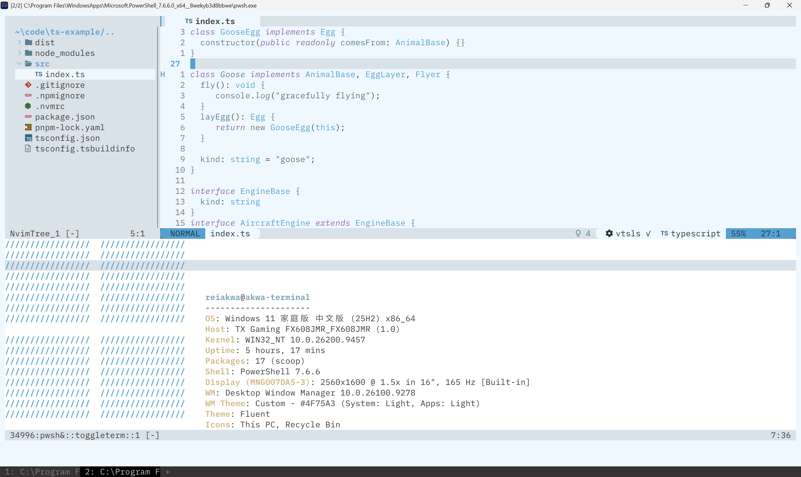

# nvim-dotfiles

基于 Neovim 0.12+ 原生插件管理器 `vim.pack` 的轻量配置，无 lazy.nvim 等第三方包管理器。

## 截图



## 环境要求

- **Neovim >= 0.12**（`vim.pack` 从 0.12 开始提供）
- `git`（用于拉取插件）

可选（用于更完整的体验）：

- `ripgrep`（`rg`）— 快速搜索
- `tree-sitter` CLI + C 编译器 — 编译 Tree-sitter 解析器
- Nerd Font（如 Sarasa Nerd Font）— 图标与 Neovide 字体

## 安装

### 一键脚本

脚本会：检测平台 -> 定位配置目录 -> 备份已有配置 -> 软链（失败自动回退复制）-> 校验 Neovim 与依赖 -> 首次启动自动安装插件。

Linux / macOS / Windows(Git Bash)：

```sh
git clone https://github.com/reiAkwa/nvim-dotfiles.git
cd nvim-dotfiles
sh install.sh
```

Windows PowerShell：

```powershell
git clone https://github.com/reiAkwa/nvim-dotfiles.git
cd nvim-dotfiles
.\install.ps1
```

可用参数：

- `--copy` / `-Copy`：复制文件而非创建符号链接
- `--no-bootstrap` / `-NoBootstrap`：跳过首次启动自动安装插件

### 手动安装

将仓库放到 Neovim 配置目录：

- Linux / macOS：`~/.config/nvim`
- Windows：`%LOCALAPPDATA%\nvim`

```sh
git clone https://github.com/reiAkwa/nvim-dotfiles.git "${XDG_CONFIG_HOME:-$HOME/.config}/nvim"
```

首次打开 `nvim` 时，`vim.pack` 会自动拉取插件；之后可用 `:checkhealth` 检查状态。

## 目录结构

```
.
├── init.lua                  # 入口
├── lua/
│   ├── options.lua           # 编辑器选项
│   ├── keymaps.lua           # 全局与 LSP 快捷键
│   ├── lspconfig.lua         # vim.lsp.enable 启用的语言服务
│   ├── neovide.lua           # Neovide 专用配置
│   └── lualine/themes/       # 自定义 lualine 主题
├── plugin/                   # 启动时自动加载，声明并配置各插件
├── colors/                   # alice 系列配色
├── install.sh                # Unix / Git Bash 安装脚本
├── install.ps1               # Windows PowerShell 安装脚本
└── nvim-pack-lock.json       # 插件版本锁定
```

## 插件

| 插件                                                                 | 用途                                  |
| -------------------------------------------------------------------- | ------------------------------------- |
| [blink.cmp](https://github.com/saghen/blink.cmp)                      | 补全（LSP / path / snippet / buffer） |
| [nvim-lspconfig](https://github.com/neovim/nvim-lspconfig)            | LSP 配置                              |
| [mason.nvim](https://github.com/mason-org/mason.nvim)                 | LSP server 安装管理                   |
| [mason-lspconfig](https://github.com/mason-org/mason-lspconfig.nvim)  | 自动安装并启用 LSP server             |
| [rustaceanvim](https://github.com/mrcjkb/rustaceanvim)                | Rust 增强                             |
| [nvim-treesitter](https://github.com/nvim-treesitter/nvim-treesitter) | 语法高亮与解析器                      |
| [nvim-treesitter-textobjects](https://github.com/nvim-treesitter/nvim-treesitter-textobjects) | 语法感知文本对象 |
| [nvim-treesitter-context](https://github.com/nvim-treesitter/nvim-treesitter-context) | 顶部显示当前代码上下文 |
| [neo-tree.nvim](https://github.com/nvim-neo-tree/neo-tree.nvim)       | 文件树（移动 / 复制 / 重命名 / 删除） |
| [toggleterm.nvim](https://github.com/akinsho/toggleterm.nvim)         | 内置终端（浮动 / 水平 / 垂直）        |
| [smart-splits.nvim](https://github.com/mrjones2014/smart-splits.nvim) | 分屏跳转与调整大小                    |
| [telescope.nvim](https://github.com/nvim-telescope/telescope.nvim)    | 模糊查找（文件 / 文本 / 缓冲区等）    |
| [plenary.nvim](https://github.com/nvim-lua/plenary.nvim)              | Telescope 依赖库                      |
| [nui.nvim](https://github.com/MunifTanjim/nui.nvim)                   | neo-tree 依赖库                       |
| [bufferline.nvim](https://github.com/akinsho/bufferline.nvim)         | 顶部标签栏                            |
| [lualine.nvim](https://github.com/nvim-lualine/lualine.nvim)          | 状态栏                                |
| [gitsigns.nvim](https://github.com/lewis6991/gitsigns.nvim)           | Git 状态标记                          |
| [mini.comment](https://github.com/nvim-mini/mini.comment)             | 快速注释                              |
| [mini.pairs](https://github.com/echasnovski/mini.pairs)               | 自动括号 / 引号补全                   |
| [mini.notify](https://github.com/nvim-mini/mini.notify)               | 通知消息美化 + LSP 进度提示           |
| [which-key.nvim](https://github.com/folke/which-key.nvim)             | 快捷键提示                            |
| [wilder.nvim](https://github.com/gelguy/wilder.nvim)                  | 命令模式补全                          |
| [mini.surround](https://github.com/nvim-mini/mini.surround)           | 括号/引号替换                         |
| [mini.bufremove](https://github.com/nvim-mini/mini.bufremove)         | 智能关闭缓冲区                        |
| [mini.icons](https://github.com/nvim-mini/mini.icons)                 | 文件类型图标（兼容 devicons API）     |
| [mini.ai](https://github.com/nvim-mini/mini.ai)                       | 增强文本对象                          |
| [mini.move](https://github.com/nvim-mini/mini.move)                   | 移动行 / 选区                         |
| [mini.operators](https://github.com/nvim-mini/mini.operators)         | 交换 / 复制 / 排序等操作符            |
| [mini.sessions](https://github.com/nvim-mini/mini.sessions)           | 会话管理                              |
| [mini.bracketed](https://github.com/nvim-mini/mini.bracketed)         | `[` / `]` 系列跳转                    |
| [hop.nvim](https://github.com/smoka7/hop.nvim)                        | 光标快速跳转                          |

## 语言服务

`lua/lspconfig.lua` 通过 `vim.lsp.enable` 启用：`vtsls`、`clangd`、`lua_ls`、`ty`、`vue_ls`、`tailwindcss`；Rust 由 rustaceanvim 提供。

## 快捷键

Leader 键为 `空格`。

| 快捷键                                        | 功能                          |
| --------------------------------------------- | ----------------------------- |
| `<C-Up>` / `<C-Down>`                     | 调整窗口高度                  |
| `<C-Left>` / `<C-Right>`                  | 调整窗口宽度                  |
| `<C-h>` / `<C-j>` / `<C-k>` / `<C-l>` | 跳转到左 / 下 / 上 / 右分屏   |
| `<M-h>` / `<M-j>` / `<M-k>` / `<M-l>` | 调整左 / 下 / 上 / 右分屏大小 |
| `gn` / `gp`                               | 下一个 / 上一个 buffer        |
| `<leader>e`                                 | 打开 / 关闭文件树             |
| `<leader>th` / `<leader>tv`               | 水平 / 垂直终端               |
| `<leader>tb`                                | 在新缓冲区打开终端            |
| `<C-t>`                                     | 切换终端（toggleterm 默认）   |
| `<leader>ff`                                | 查找文件                      |
| `<leader>fg`                                | 实时全文搜索                  |
| `<leader>fw`                                | 搜索光标下单词                |
| `<leader>fb`                                | 切换缓冲区                    |
| `<leader>fh`                                | 搜索帮助文档                  |
| `<leader>fr`                                | 最近打开的文件                |
| `<leader>fd`                                | 搜索诊断信息                  |
| `<leader>bd` / `<leader>bw`               | 关闭 / 彻底关闭当前缓冲区     |
| `sa`                                        | 添加包围符号（括号 / 引号等） |
| `sd`                                        | 删除包围符号                  |
| `sr`                                        | 替换包围符号                  |
| `sf` / `sF`                               | 查找右侧 / 左侧包围符号       |
| `sh`                                        | 高亮包围符号                  |
| `gc` / `gcc`（可视 / 普通）                | 注释 / 取消注释               |
| `<M-h>` / `<M-l>` / `<M-j>` / `<M-k>`（可视） | 移动选中内容                 |
| `<M-Left>` / `<M-Right>` / `<M-Down>` / `<M-Up>` | 移动当前行               |
| `an` / `in` / `al` / `il`                 | 下一个 / 上一个文本对象       |
| `am` / `im` / `ac` / `ic`                 | 选择函数 / 类（外 / 内）      |
| `]m` / `[m` / `]M` / `[M`               | 下一个 / 上一个函数开头 / 结尾 |
| `g[` / `g]`                               | 跳转到文本对象边界            |
| `gx` / `gm` / `gs` / `gR` / `g=`         | 交换 / 复制 / 排序 / 替换 / 求值 |
| `<leader>ss` / `<leader>sl` / `<leader>sd` | 保存 / 加载 / 删除会话       |
| `[` / `]` + 字母                          | 各类跳转（buffer / 诊断 / 缩进等） |
| `<leader>hw` / `<leader>hl`               | 跳转到单词 / 行               |
| `<leader>hc` / `<leader>hj`               | 跳转到字符 / 行首             |
| `<leader>a`（Rust）                         | 代码操作                      |
| `gd` / `gD`                               | 跳转定义 / 声明               |
| `gi` / `go`                               | 实现 / 类型定义               |
| `K`                                         | 悬停文档（Rust 下含操作）     |
| `gl`                                        | 显示诊断浮窗                  |

## 配色

内置 alice 系列，默认 `alice_sunny`（在 `init.lua` 中切换）：

- `alice_sunny`
- `alice_nightly`
- `alice_rainy`

`lua/lualine/themes/` 下有对应的 lualine 主题。
